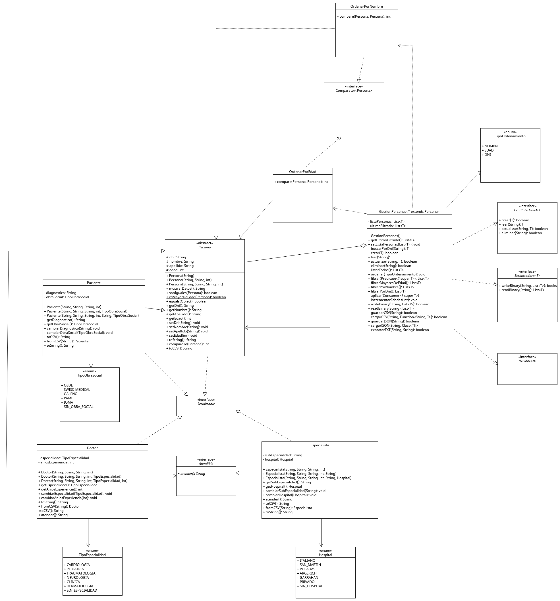

# CRUD - Gestión de Personas en un Hospital
Mi nombre es Ignacio Lafuente y tengo 19 años.
Soy estudiante de la Tecnicatura Universitaria en programación de la UTN Avellaneda, este proyecto se realizo para el examen final de programacion II.

## Resumen de la Aplicación
Esta aplicacion ofrece un CRUD completo de personas dentro de un entorno hospitalario.
Permite gestionar:
- Pacientes
- Doctores
- Especialistas

Todas estas entidades pueden ser:
- Creadas
- Leidas
- Actualizadas
- Eliminadas
- Filtradas (por distintos criterios)
- Ordenadas (por distintos criterios)
- Guardadas y cargadas en formatos (`.csv`, `.json`, `.dat`, `.txt`)
    
La interfaz grafica fue desarrollada mediante el uso de JavaFX y SceneBuilder

---

### Imagen del diagrama `UML`

